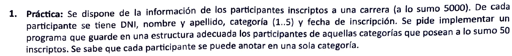
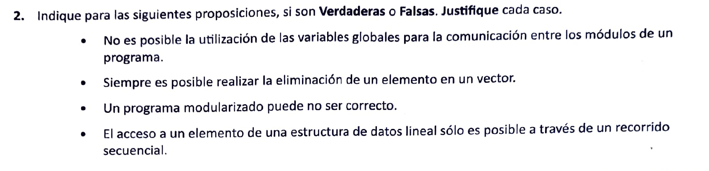
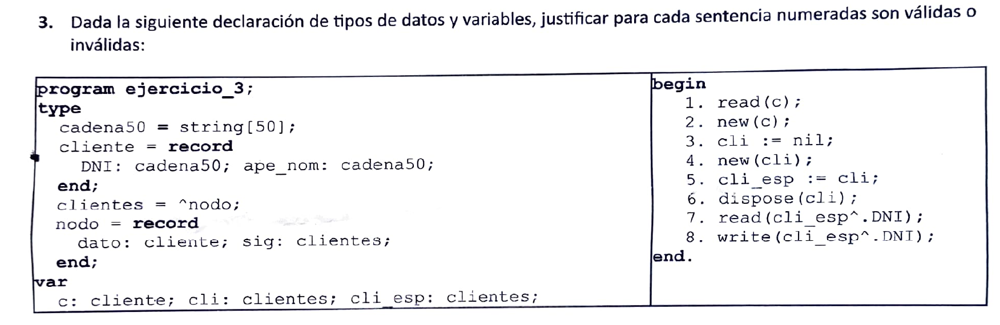
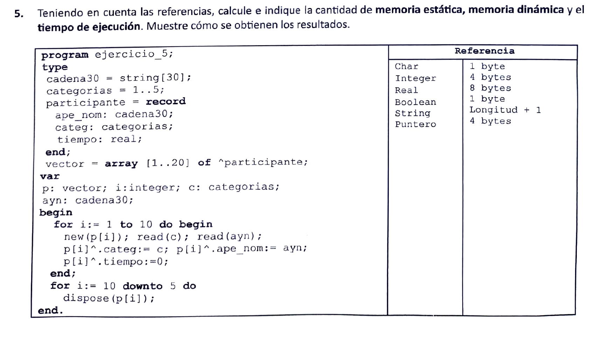

+ No es posible la utilizacion de variables globales para la comunicación entre los modulos de un programa. [**falso**]

Sí, se puede usar variables globales para la comunicacion entre modulos. Sin embargo, es desaconsejable ya que esto hace mas dificil mantener buenas practicas como lo son la alta cohesion y el bajo acoplamiento entre modulos. Los modulos deberian poder actuar independientemente o dependiendo de otros lo menos posible. Usar variables globales para la comunicacion entre ellos, hace que un cambio hecho por un modulo, pueda afectar el funcionamiento de otro, afectando mantenibilidad y legibilidad.

+ Siempre es posible realizar la eliminacion de un elemento en un vector [**falso**]

No siempre es posible eliminar un elemento en un vector, ya que hay casos especiales que debemos considerar. Por ejemplo, el vector podria estar vacio y no haber nada para eliminar. Tambien podria suceder que haya elementos que el elemento que queremos eliminar no se encuentre en el vector.

+ Un programa modularizado puede no ser correcto [**verdadero**]

Sí, un programa modularizado adecuadamente puede no ser correcto. Por definicion, la correctitud de un programa no depende solamente de si esta modularizado o no. Un programa correcto debe cumplir con los requerimientos propuestos, que pueden incluir otras cosas ademas de estar correctamente modularizado.

+ El acceso a un elemento de una estructura de datos lineal solo es posible mediante un recorrido secuencial [**verdadero**]

Sí, para acceder a un elemento dado en una estructura de datos lineal, se debe pasar por todos los elementos anteriores al que se intenta acceder. Esto es porque en una estructura de datos de este tipo, los elementos solo guardan una relacion anterior-posterior entre sí. Es decir, no es posible acceder a un elemento deseado directamente.

1. [**invalida**]. Se esta intentado leer _c_ que es un registro. Esto no se puede hacer. Si se quiere leer los campos del registro, de debe especificar cada uno.
2. [**invalida**]. Se intenta dedicar espacio en memoria a la variable _c_ que es un registro. Las instrucciones _new_ y _dispose_ solo se pueden usar con punteros.
3. [**valida**]. Se esta igualando cli a nil. Esto se puede hacer ya que cli es un puntero y como puntero, puede setearse a apuntar a nil.
4. [**valida**]. Se esta reservando espacio en memoria para la variable _cli_. Esto es valido ya que _cli_ es un puntero.
5. [**valida**]. Se esta igualando dos punteros, esto se puede hacer mientras que los punteros apunten al mismo tipo de dato. Ambos punteros apuntan a un registro nodo, por lo que es valido.
6. [**valida**]. Se esta liberando el espacio de memoria de la variable _cli_. Como _cli_ es puntero, esto es valido.
7. [**invalida**]. Se esta intentando ingresar por consola a un campo del registro que no existe. Si se quisiese modificar el campo DNI, se deberia acceder a "cli^.dato.DNI".
8. [**invalida**]. El error es similar, ya que se esta intentando imprimir un campo que no existe en el registro al que apunta _cli_. Para leer el campo DNI se deberia acceder a "cli^.dato.DNI".

