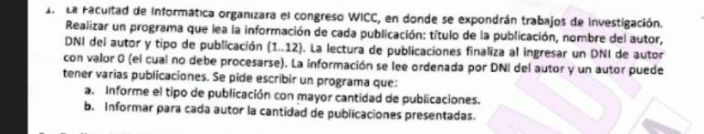
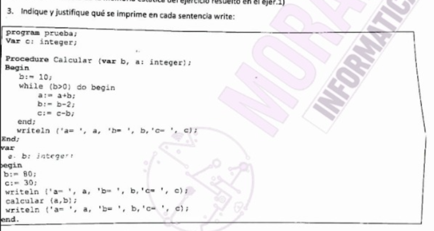
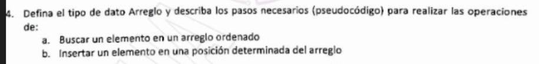
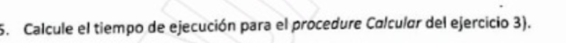
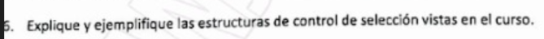

En el primer writeln _writeln('a= ', a, 'b= ', b, 'c= ', c);_ se imprime basura para la variable _a_ ya que no se le fue asignado ningun valor, 80 para _b_ y 30 para _c_.

En la llamada al modulo Calcular, el writeln adentro del modulo imprime basura para _a_, 0 para _b_ y 10 para _c_.

En el segundo writeln del programa principal se imprime basura para _a_, 0 para _b_ y 10 para _c_.







Las estructuras de control de seleccion vistas son: if _condicion_ then _hacer_, if _condicion_ then _hacer_ else _hacer_, case _variable_ of _casos_: _hacer_.

If

``` pascal
if x > 0 then
  writeln('x es positivo');
```

If else

```
if x mod 2 = 0 then
  writeln('x es par')
else
  writeln('x es impar');
```

case of

```
case dia of
  1: writeln('Lunes');
  2: writeln('Martes');
  3: writeln('Miércoles');
  4: writeln('Jueves');
  5: writeln('Viernes');
  6: writeln('Sábado');
  7: writeln('Domingo');
else
  writeln('Día inválido');
end;
```

