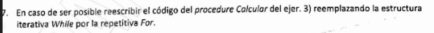

``` pascal

Program Final;


// La facultad de informatica organizará el congreso WICC, en donde se expondran trabajos de investigacion. Realizar un programa que lea la informacion de cada publicacion; titulo, nombre del autor, DNI del autor, tipo de publicacion (1..12). La lectura de publicaciones finaliza al ingresar un DNI del autor con valor 0 el cual no debe procesarse. La informacion se lee ordenada por DNI del autor y un autor puede tener varias publicaciones.

// Se pide escribir un programa que:

// - Informar el tipo de publicacion con mayor cantidad de publicaciones.

// - Informar para cada autor la cantidad de publicaciones presentadas.

Type
    cadena30 =   String[30];
    tipoPub =   1..12;

    publicacion =   Record
        titulo, nombre:   cadena30;
        DNI:   integer;
        tipo:   tipoPub;
    End;

    ArrPub =   Array[tipoPub] Of integer;

    ptrnodo =   ^nodo;
    nodo =   Record
        autor:   cadena30;
        cant:   integer;
        sig:   ptrnodo;
    End;

Procedure InsertarAutor(Var Lista: ptrnodo; pub: publicacion);

Var
    ant, act, nodo:   ptrnodo;

Begin
    ant := Nil;
    act := Lista;

    While (act <> Nil) And (act^.autor <> pub.nombre) Do
        Begin
            ant := act;
            act := act^.sig;
        End;

    If (ant = Nil) Then
        Begin
            if (act <> nil) then begin
                act^.cant := act^.cant + 1;
            end else Begin
                new(nodo);
                nodo^.autor := pub.nombre;
                nodo^.cant := 1;
                nodo^.sig := nil;

                Lista := nodo;
            end;
        End
    Else If (act = Nil) Then
            Begin
                new(nodo);
                nodo^.autor := pub.nombre;
                nodo^.cant := 1;
                nodo^.sig := nil;

                ant^.sig := nodo;
            End
    Else
        Begin
            act^.cant := act^.cant + 1;
        End;
End;

procedure InicializarArrPub (var V: ArrPub);

var
    i: integer;

begin
    for i := 1 to 12 do begin
        V[i] := 0;
    end;
end;

function HallarMaxEnArrPub (V: ArrPub): tipoPub;

var
    i, maxIn: tipoPub;
    max1: integer;

begin
    max1 := -1;

    for i := 1 to 12 do begin
        if (V[i] > max1) then begin
            max1 := V[i];
            maxIn := i;
        end;
    end;

    HallarMaxEnArrPub := maxIn;
end;

Procedure LeerPublicacion(Var pub: publicacion);

Begin
    writeln('Ingresar el DNI del autor');
    readln(pub.DNI);

    If pub.DNI <> 0 Then
        Begin
            writeln('Ingrese el nombre del autor');
            readln(pub.nombre);

            writeln('Ingresar el titulo de la publicacion');
            readln(pub.titulo);

            writeln('Ingrese el tipo de publicacion (1 a 12)');
            readln(pub.tipo);
            While Not (pub.tipo In [1, 2, 3, 4, 5, 6, 7, 8, 9, 10, 11, 12]) Do
                Begin
                    writeln('Ingresar un tipo valido (1 a 12)');
                    readln(pub.tipo);
                End;
        End;
End;

Procedure Principal(var Lista: ptrnodo);

Var
    pub:   publicacion;
    ArregloPublicaciones: ArrPub;

Begin
    InicializarArrPub(ArregloPublicaciones);
    LeerPublicacion(pub);

    While pub.DNI <> 0 Do Begin
            InsertarAutor(Lista, pub);
            LeerPublicacion(pub);

            ArregloPublicaciones[pub.tipo] := ArregloPublicaciones[pub.tipo] + 1;
        End;

    writeln('El tipo de publicacion mas frecuente es el nro: ', HallarMaxEnArrPub(ArregloPublicaciones));
End;

procedure InformarListaAutores(Lista: ptrnodo);

begin
    while (Lista <> nil) do begin
        writeln('Para el autor ', Lista^.autor, ', se registraron ', Lista^.cant, ' publicaciones diferentes.');

        Lista := Lista^.sig;
    end;
end;

procedure LiberarLista(var Lista: ptrnodo);

var
    aux: ptrnodo;

begin
    while (Lista <> nil) do begin
        aux := Lista;
        Lista := Lista^.sig;
        dispose(aux);
    end;
end;

var
    ListaAutores: ptrnodo;

Begin
    Principal(ListaAutores);

    InformarListaAutores(ListaAutores);
End.

```


Para la **memoria estatica** debemos considerar las declaraciones var:

```
Var
    ant, act, nodo:   ptrnodo;

Var
    i:   integer;

Var
    i, maxIn:   tipoPub;
    max1:   integer;

Var
    pub:   publicacion;
    ArregloPublicaciones:   ArrPub;

Var
    aux:   ptrnodo;

Var
    ListaAutores:   ptrnodo;
```

Usando la siguiente tabla:

| Tipo de dato       | Tamaño (bytes) |
|---------------------|----------------|
| `char`              | 1              |
| `boolean`           | 1              |
| `integer`           | 4              |
| `real`              | 8              |
| `puntero`           | 4              |
| `string[n]`         | n + 1          |
| `subrango` (ej. 1..k) | 4            |

---

3 punteros * 4 bytes = 12 bytes

---

1 integer * 4 bytes = 4

---

2 tipoPub * 4 bytes + 1 integer * 4 bytes = 12 bytes

---

En el registro publicacion hay:

+ Nombre (String[30])-> 31 bytes
+ Titulo (") -> 31 bytes
+ DNI (Integer) -> 4 bytes
+ Tipo (tipoPub) -> 4 bytes

En total 1 registro pub consume (31 + 31 + 4 + 4) bytes = 70 bytes

1 publicacion * 70 bytes + 1 ArrPub * (12 integer * 4 bytes) bytes = 118 bytes

---

1 puntero * 4 bytes = 4 bytes

---

1 puntero * 4 bytes = 4

---

Efectuando la suma de todas las declaraciones Var obtenemos:

(4 + 4 + 118 + 12 + 4 + 12) bytes = 154 bytes

A este valor le debemos sumar la cantidad de bytes que ocupan los parametros de cada funcion y procedimiento:

InsertarAutor(var Lista: ptrnodo; pub: publicacion)
Lista: var -> puntero = 4
pub: valor -> registro = 70 (31+31+4+4)
Total = 74

InicializarArrPub(var V: ArrPub)
V: var -> puntero = 4
Total = 4

HallarMaxEnArrPub(V: ArrPub)
V: valor -> arreglo 12*4 = 48
Total = 48

LeerPublicacion(var pub: publicacion)
pub: var -> puntero = 4
Total = 4

Principal(var Lista: ptrnodo)
Lista: var -> puntero = 4
Total = 4

InformarListaAutores(Lista: ptrnodo)
Lista: valor -> puntero = 4
Total = 4

LiberarLista(var Lista: ptrnodo)
Lista: var -> puntero = 4
Total = 4

> 74 + 4 + 48 + 4 + 4 + 4 + 4; = 142 bytes

De esta manera, la memoria estatica es:

> (142 + 154) bytes = 296 bytes

Para la **memoria dinámica** nos fijamos en que lugares del programa se crean los nodos de las listas. Eso sucede al agregar nodos a la lista de autores. Calculamos cuanta memoria ocupa un registro nodo:

``` pascal
ptrnodo =   ^nodo;
    nodo =   Record
        autor:   cadena30;
        cant:   integer;
        sig:   ptrnodo;
    End;
```

El registro nodo tiene:
+ autor (String[30]) -> (30 + 1) bytes = 31 bytes
+ cant (Integer) -> 4 bytes
+ sig (Puntero) -> 4 bytes

Entonces, cada registro nodo consume:

(31 + 4 + 4) bytes = 39 bytes

La cantidad de registros nodo, asi como la memoria dinámica va a ser una funcion de la cantidad de autores unicos que haya, digamos, n:

Memoria Estática = 39 bytes * n autores

Tambien es necesario aclarar que el programa finaliza con una memoria estatica de 0 bytes ya que la lista de autores es liberada al final de la ejecucion.


En el primer writeln _writeln('a= ', a, 'b= ', b, 'c= ', c);_ se imprime basura para la variable _a_ ya que no se le fue asignado ningun valor, 80 para _b_ y 30 para _c_.

En la llamada al modulo Calcular, el writeln adentro del modulo imprime basura para _a_, 0 para _b_ y 10 para _c_.

En el segundo writeln del programa principal se imprime basura para _a_, 0 para _b_ y 10 para _c_.


El tipo de dato arreglo es una estructura de datos del tipo estatica, homogenea y de acceso directo (por indice).

a) Para buscar un elemento en un arreglo ordenado:

``` pseudocode
Funcion BuscarEnArreglo(Arreglo, dato): TipoIndice;

var
    medio, der, izq: TipoIndice;

begin
    der := DimensionLogica;
    izq := 1;

    Mientras (der >= izq)
        medio := (der + izq) div 2;

        Si (Arreglo[medio] = dato) entonces
            Se encontro el dato;
            Devolver medio;
        O si no (Arreglo[medio] > dato) entonces
            der := medio - 1;
        O si no (Arreglo[medio] < dato) entonces
            izq := medio + 1;
    Informar que no se encontro el dato buscado en el arreglo
end;
```

b) Insertar elemento en posicion de un arreglo

``` pseudocode
Procedimiento InsertarEnArreglo(Arreglo, dato, pos);

var
    i: TipoIndice;

begin
    Si (pos < 1) o (pos > DimensionLogica + 1) entonces
        Informar 'Posición inválida';
        Salir del procedimiento;

    // Corrimiento de los elementos
    Para i := DimensionLogica hasta pos hacer
        Arreglo[i + 1] := Arreglo[i];

    // Insertar el nuevo dato
    Arreglo[pos] := dato;

    // Actualizar la dimensión lógica
    DimensionLogica := DimensionLogica + 1;

    Informar dato insertado con exito en pos;
end;
```


El procedure del punto 3 es:

``` pascal
Procedure Calcular(var b, a: integer);
Begin
    b := 10;
    while (b > 0) do
    begin
        a := a + b;
        b := b - 2;
        c := c - b;
    end;
    writeln('a= ', a, ' b= ', b, ' c= ', c);
end;
```

Para calcular el **tiempo de ejecución**:

Sabemos del punto 3 que el while se ejecuta 5 veces, por lo que la estructura del while consume 5 validaciones true + 1 false = 6 UT.

Ahora consideremos el cuerpo del while. Hay 6 operaciones que se realizan un total de 5 veces -> 5 * 6 = 30 UT. De esta manera el while completo consume (30 + 6) UT = 36 UT.

El writeln no se considera.

La asignacion de _b := 10_ al principio consume 1UT.

En total el procedimiento completo consume:

(36 + 1) UT = 37 UT


Las estructuras de control de seleccion vistas son: if _condicion_ then _hacer_, if _condicion_ then _hacer_ else _hacer_, case _variable_ of _casos_: _hacer_.

If

``` pascal
if x > 0 then
  writeln('x es positivo');
```

Se usa para marcar un bloque de codigo a ejecutar si se cumple una condicion o serie de condiciones

If else

```
if x mod 2 = 0 then
  writeln('x es par')
else
  writeln('x es impar');
```

Se usa para marcar los bloques de codigo a ejecutar si se cumple una condicion u otra.

case of

``` pascal
case dia of
  1: writeln('Lunes');
  2: writeln('Martes');
  3: writeln('Miércoles');
  4: writeln('Jueves');
  5: writeln('Viernes');
  6: writeln('Sábado');
  7: writeln('Domingo');
else
  writeln('Día inválido');
end;
```

Se usa para especificar que se debe hacer en cada caso del valor de una variable, en este caso, del integer _dia_.

